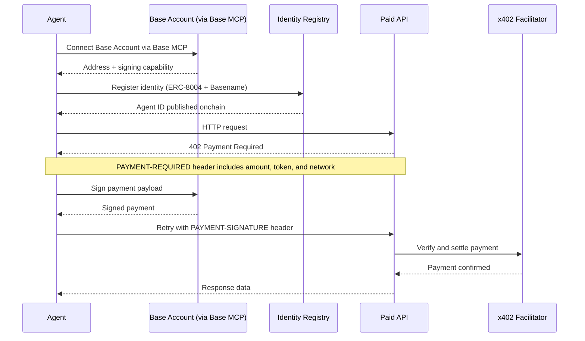

import { AgentPaymentDemo } from "/snippets/AgentPaymentDemo.jsx"

Base gives your AI agent the tools to operate as an independent economic actor: a wallet to hold and spend funds, identity standards so other agents and services can trust it, and payment protocols for services and commerce.

## Mock Demo

<AgentPaymentDemo />

### High-level flow

Here's how the agent you can build from these guides operates end-to-end — from wallet setup and identity registration to making authenticated, paid API requests using the [x402 protocol](https://www.x402.org).

## How this section is organized

The AI agents section covers the full stack for building an autonomous onchain agent:

- **[Quickstarts](/ai-agents/quickstart/payments)** — End-to-end walkthroughs to get a working agent running in minutes. Start here if you're new.
- **[Setup](/ai-agents/setup/wallet-setup)** — Give your agent a wallet via [Base MCP](/ai-agents/skills/wallets/base-mcp) and a registered onchain identity. The wallet lets it hold funds and authorize transactions; registration lets other agents and services verify who they're dealing with.
- **[Transactions](/ai-agents/transactions/send-swap)** — Send tokens, swap, pay for x402 services, accept payments, and execute arbitrary protocol calls via `send_calls`.
- **[Skills](/ai-agents/skills)** — Installable knowledge packs that give your AI coding assistant deep context on Base APIs, protocols, and tooling.

## Choose your path

<CardGroup cols={2}>
  <Card title="Pay for & accept services" icon="bolt" href="/ai-agents/quickstart/payments">
    Build an agent that pays for API access with stablecoins and charges other agents for your services. Get running in under 10 minutes.
  </Card>

  <Card title="Build a trading agent" icon="chart-line" href="/ai-agents/quickstart/trading">
    Build an agent that swaps tokens on Uniswap, deposits into Morpho, and executes any DeFi protocol on Base.
  </Card>
</CardGroup>
