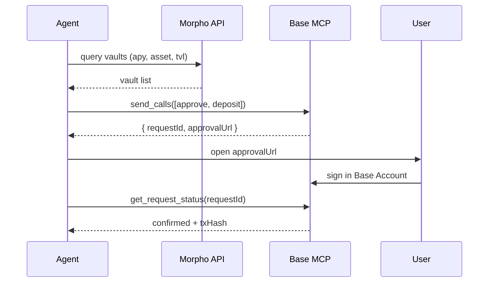

Morpho vaults are ERC-4626 contracts on Base that earn yield on stablecoins and ETH. Your agent picks a vault, builds an `approve` + `deposit` (or `redeem`) batch, and submits it through [Base MCP's `send_calls`](/ai-agents/skills/wallets/base-mcp). The same pattern covers borrowing on Morpho Blue markets.

## Pattern



## Step 1 — Pick a vault

Use the [Morpho CLI](https://github.com/morpho-org/morpho-cli) (or the [GraphQL API](https://docs.morpho.org/morpho/getting-started/api/)) to find the best vault for your asset and risk profile:

```bash Terminal
npx @morpho-org/cli@latest vaults --chain base --asset USDC
```

The CLI returns each vault's address, current APY, TVL, allocator, and risk allocations. Pick a vault address — for example, the Steakhouse USDC vault.

## Step 2 — Build the deposit batch

A Morpho vault deposit is a two-call sequence: `approve` USDC for the vault, then call the vault's `deposit(uint256 assets, address receiver)` (ERC-4626):

```typescript Calldata
import { encodeFunctionData, erc20Abi, parseUnits } from "viem";

const vault = "0xVaultAddress";
const usdc = "0x833589fCD6eDb6E08f4c7C32D4f71b54bdA02913";
const amount = parseUnits("100", 6);
const receiver = "0xYourAgentWalletAddress";

const approveData = encodeFunctionData({
  abi: erc20Abi,
  functionName: "approve",
  args: [vault, amount],
});

const depositAbi = [{
  name: "deposit",
  type: "function",
  inputs: [
    { name: "assets", type: "uint256" },
    { name: "receiver", type: "address" },
  ],
  outputs: [{ name: "shares", type: "uint256" }],
}] as const;

const depositData = encodeFunctionData({
  abi: depositAbi,
  functionName: "deposit",
  args: [amount, receiver],
});
```

## Step 3 — Submit via `send_calls`

```json send_calls payload
{
  "chainId": 8453,
  "calls": [
    { "to": "0x833589fCD6eDb6E08f4c7C32D4f71b54bdA02913", "data": "<approveData>", "value": "0x0" },
    { "to": "<vault>", "data": "<depositData>", "value": "0x0" }
  ],
  "atomicRequired": true
}
```

Base MCP returns `{ requestId, approvalUrl }`. The user signs the batch in their Base Account and Morpho mints vault shares to `receiver`.

## Withdraw

Withdrawing is a single call — no approval needed, since the agent already holds the shares. Use `redeem(uint256 shares, address receiver, address owner)` for a share-denominated exit, or `withdraw(uint256 assets, address receiver, address owner)` to pull a specific asset amount.

```typescript Withdraw
const redeemData = encodeFunctionData({
  abi: [{
    name: "redeem",
    type: "function",
    inputs: [
      { name: "shares", type: "uint256" },
      { name: "receiver", type: "address" },
      { name: "owner", type: "address" },
    ],
    outputs: [{ name: "assets", type: "uint256" }],
  }],
  functionName: "redeem",
  args: [shares, receiver, owner],
});
```

Pass it as a single-call `send_calls` batch.

## Borrowing on Morpho Blue

For market-level supply/borrow (instead of vaults), use Morpho Blue's [Bundler](https://docs.morpho.org/morpho/contracts/bundler/) to combine collateral supply, borrow, and downstream actions into one `send_calls` batch. The Morpho CLI emits ready-to-submit Bundler calldata when you ask for an unsigned operation:

```bash Terminal
npx @morpho-org/cli@latest borrow --chain base --market <id> --collateral 1ETH --borrow 1000USDC --dry-run
```

The `--dry-run` output is a `to` + `data` payload you can pass straight into `send_calls`.

## Errors

| Failure | Likely cause | What to do |
|---------|--------------|------------|
| Vault `deposit` reverts with `ERC4626ExceededMaxDeposit` | Vault is at its supply cap | Pick another vault or wait for the cap to lift |
| `redeem` returns 0 assets | Vault is paused or in cooldown | Check `maxRedeem(owner)` before submitting |
| `4001` from Base MCP | User rejected approval | Surface the rejection and ask to retry |

## Reference

- [Morpho CLI →](https://github.com/morpho-org/morpho-cli)
- [Morpho API →](https://docs.morpho.org/morpho/getting-started/api/)
- [Morpho Bundler →](https://docs.morpho.org/morpho/contracts/bundler/)
- [Base MCP `send_calls` →](/ai-agents/skills/wallets/base-mcp)
