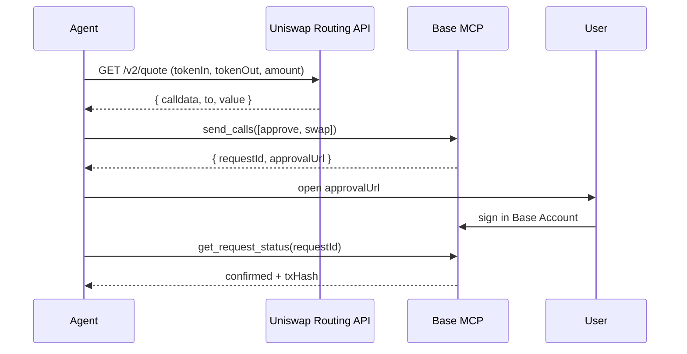

Uniswap's Universal Router is the canonical way to swap on Base. Your agent fetches a route from Uniswap's API, builds the calldata, and submits it through [Base MCP's `send_calls`](/ai-agents/skills/wallets/base-mcp). This pattern works for any pool — v2, v3, v4, and mixed-route trades.

## Pattern



## Step 1 — Get a quote

Uniswap's [Routing API](https://docs.uniswap.org/api/quote/overview) returns a fully-encoded swap transaction. Use the Base chain ID (`8453`):

```bash Terminal
curl -X POST "https://trade-api.gateway.uniswap.org/v1/quote" \
  -H "Content-Type: application/json" \
  -d '{
    "tokenInChainId": 8453,
    "tokenOutChainId": 8453,
    "tokenIn": "0x833589fCD6eDb6E08f4c7C32D4f71b54bdA02913",
    "tokenOut": "NATIVE",
    "amount": "50000000",
    "type": "EXACT_INPUT",
    "swapper": "0xYourAgentWalletAddress",
    "protocols": ["V2", "V3", "MIXED"]
  }'
```

The `tokenIn` above is USDC on Base. The response includes a `quote.tx` object with `to`, `data`, and `value` ready to submit.

## Step 2 — Submit via `send_calls`

Have your agent build a two-call batch — `approve` USDC for the Universal Router, then the Universal Router `execute` call. Pass both to `send_calls` so they settle atomically.

```text Prompt
Swap 50 USDC for ETH on Base using the Uniswap quote at <quote-url>.
Construct send_calls with the approve + execute calls and return the approvalUrl.
```

Your agent calls `send_calls` with payload like:

```json send_calls payload
{
  "chainId": 8453,
  "calls": [
    {
      "to": "0x833589fCD6eDb6E08f4c7C32D4f71b54bdA02913",
      "data": "0x095ea7b3000000000000000000000000<UniversalRouter>00000000000000000000000000000000000000000000000000000000ffffffff",
      "value": "0x0"
    },
    {
      "to": "<UniversalRouter>",
      "data": "<calldata from Uniswap quote>",
      "value": "<value from Uniswap quote>"
    }
  ],
  "atomicRequired": true
}
```

The Universal Router address on Base is published in the [Uniswap deployments](https://docs.uniswap.org/contracts/v3/reference/deployments). For permit2-based flows, swap the `approve` call for a `permit2.approve` + signed permit and skip the ERC-20 approval entirely.

## Step 3 — Confirm

Base MCP returns `{ requestId, approvalUrl }`. After the user signs in their browser, poll `get_request_status` until it returns `confirmed`. The Universal Router emits standard `Swap` events you can decode from the receipt.

## Slippage and deadlines

Uniswap encodes both into the calldata, but agents should still:

- Set `slippageTolerance` on the quote request (e.g. `"0.5"` for 0.5%) — Uniswap rejects routes that exceed it
- Set a deadline 60–120 seconds in the future — the calldata reverts past it
- Re-quote if more than 30 seconds pass between quote and submission — pricing on Base moves fast

## Errors

| Failure | Likely cause | What to do |
|---------|--------------|------------|
| `4001` from Base MCP | User closed approval tab | Surface the rejection and ask to retry |
| Reverts with `V3TooLittleReceived` | Slippage tightened past tolerance during routing | Re-quote and resubmit |
| Reverts with `TRANSFER_FROM_FAILED` | Approval missing or insufficient | Make sure the `approve` call is in the same batch and the amount covers the swap |

## Reference

- [Uniswap Routing API →](https://docs.uniswap.org/api/quote/overview)
- [Uniswap deployments on Base →](https://docs.uniswap.org/contracts/v3/reference/deployments)
- [Base MCP `send_calls` →](/ai-agents/skills/wallets/base-mcp)
- [`wallet_sendCalls` reference →](/base-account/reference/core/provider-rpc-methods/wallet_sendCalls)
