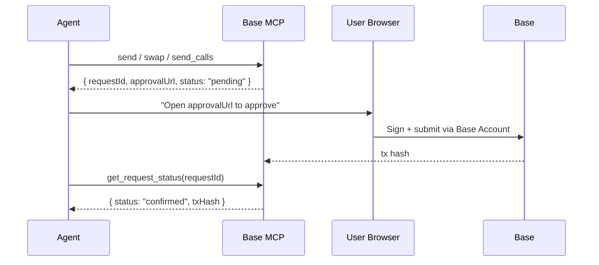

Base MCP is the official Model Context Protocol server for the Base Account. It plugs your AI agent into a Base Account wallet so it can read portfolio state, send tokens, swap, sign messages, and execute arbitrary EIP-5792 batched contract calls. Anything your agent submits is held until the user (or a pre-authorized agent wallet) opens the returned `approvalUrl` and confirms onchain.

## Install

Add Base MCP to your client's MCP config (Claude Desktop is shown below — Cursor, Claude Code, and Codex all use the same package):

```json claude_desktop_config.json
{
  "mcpServers": {
    "base-mcp": {
      "command": "npx",
      "args": ["-y", "@base-org/account-mcp@latest"]
    }
  }
}
```

Restart the client. On first use, Base MCP opens a browser window to connect a Base Account — no API keys, no seed phrase.

<Tip>
Claude Code, Codex, OpenCode, and Cursor all read the same MCP config patterns. Use the same `npx` command in `~/.codex/config.toml` or `~/.cursor/mcp.json`.
</Tip>

## Tool reference

Base MCP exposes one cohesive set of tools. Tools that move funds or change state return an `approvalUrl` and a `requestId` instead of executing immediately.

### Read tools

| Tool | What it does |
|------|--------------|
| `get_wallets` | Lists Base Accounts available to the agent |
| `get_portfolio` | Returns balances across supported networks for a wallet |
| `get_transaction_history` | Returns recent transactions for a wallet |
| `search_tokens` | Resolves a symbol or partial name to token contract addresses on a given network |

### Write tools

All write tools return `{ requestId, approvalUrl, status }`. Poll `get_request_status` (or open the URL in the user's browser) to drive the transaction to completion.

| Tool | What it does |
|------|--------------|
| `send` | Transfer ETH, USDC, or any ERC-20 to an address, ENS, or basename |
| `swap` | Swap one token for another by symbol or contract address |
| `send_calls` | Submit one or more EIP-5792 contract calls atomically — the extensibility primitive for any DeFi protocol |
| `sign` | Sign an arbitrary EIP-191 or EIP-712 payload |
| `get_request_status` | Poll the status of a previously returned `requestId` |

### Approval flow



For agents that need to act without per-transaction approvals (e.g. background trading), connect a dedicated **agent wallet** with pre-authorized [spend permissions](/base-account/improve-ux/spend-permissions) — `send` and `swap` then settle without an `approvalUrl`.

## Examples

### Check a balance

```text Prompt
What's in my Base Account?
```

The agent calls `get_wallets` followed by `get_portfolio` and summarizes the result.

### Send USDC

```text Prompt
Send 5 USDC to vitalik.base.eth
```

`send` resolves the basename, returns an `approvalUrl`, and you sign in the browser.

### Swap

```text Prompt
Swap 50 USDC for ETH on Base
```

`swap` builds the route and returns an `approvalUrl`. After the user signs, `get_request_status` reports `confirmed` with the tx hash.

### Arbitrary contract call

```text Prompt
Stake 100 USDC into the Spark USDC vault on Base
```

The agent uses `search_tokens` to find USDC, builds approve + deposit calldata, and submits both via `send_calls` in a single atomic batch. See [Protocol interactions](/ai-agents/transactions/protocol-interactions) for the full pattern.

## Base MCP vs. CDP Agentic Wallet

Both give your agent a wallet. Pick based on how your agent runs:

| | Base MCP | [CDP Agentic Wallet](/ai-agents/skills/wallets/cdp-agentic-wallet) |
|--|----------|-----------------------------------------------|
| Auth | Base Account in browser | Email OTP |
| Approval model | Per-transaction `approvalUrl` (or pre-authorized agent wallet) | Email-confirmed sign-in, then autonomous |
| Networks | Base, Ethereum, others via `send_calls` | Base |
| Arbitrary contract calls | Yes (`send_calls`) | Limited to bundled skills |
| Distribution | MCP server | Skills package (`npx skills add coinbase/agentic-wallet-skills`) |

Use **Base MCP** when you want a single MCP-native integration with maximum extensibility. Use **CDP Agentic Wallet** when you want an autonomous, email-authenticated agent that runs without a browser in the loop.

## Reference

- [Base Account docs →](/base-account/overview/what-is-base-account)
- [`wallet_sendCalls` (EIP-5792) →](/base-account/reference/core/provider-rpc-methods/wallet_sendCalls)
- [Base MCP on GitHub →](https://github.com/base/base-mcp)
