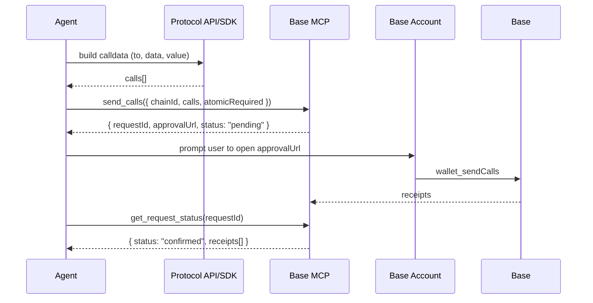

`send` and `swap` cover everyday transfers and trades. For everything else — staking, lending, liquidity, governance, NFT marketplaces — Base MCP exposes [`send_calls`](https://eips.ethereum.org/EIPS/eip-5792). It accepts an array of raw contract calls and submits them atomically to the user's Base Account. This is the primitive that makes Base MCP extensible to any protocol on Base.

## When to use `send_calls`

| You want to… | Use |
|--------------|-----|
| Send ETH or an ERC-20 to an address | [`send`](/ai-agents/transactions/send-swap#send) |
| Swap one token for another at the best route | [`swap`](/ai-agents/transactions/send-swap#swap) |
| Approve + swap atomically with custom calldata | `send_calls` |
| Deposit into Morpho, Aave, or any ERC-4626 vault | `send_calls` |
| Mint, vote, claim airdrop, or call any contract | `send_calls` |

## How it works



Internally, `send_calls` is a wrapper over the [`wallet_sendCalls`](/base-account/reference/core/provider-rpc-methods/wallet_sendCalls) RPC defined in EIP-5792. The Base Account executes every call in the batch in order; with `atomicRequired: true`, all calls must succeed or none do.

## Example: approve + swap on Uniswap

The classic two-call batch — approve USDC for the Universal Router, then call the router's `execute`:

```typescript Build calls
import { encodeFunctionData, erc20Abi, maxUint256 } from "viem";

const usdc = "0x833589fCD6eDb6E08f4c7C32D4f71b54bdA02913";
const universalRouter = "0x6fF5693b99212Da76ad316178A184AB56D299b43";

const calls = [
  {
    to: usdc,
    data: encodeFunctionData({
      abi: erc20Abi,
      functionName: "approve",
      args: [universalRouter, maxUint256],
    }),
    value: "0x0",
  },
  {
    to: universalRouter,
    data: uniswapQuote.tx.data,
    value: uniswapQuote.tx.value ?? "0x0",
  },
];
```

Submit via `send_calls`:

```json send_calls payload
{
  "chainId": 8453,
  "calls": "<calls from above>",
  "atomicRequired": true
}
```

Base MCP returns `{ requestId, approvalUrl }`. After the user signs, both calls land in a single transaction — if the swap reverts, the approval is rolled back too.

## Building calldata

Every protocol exposes calldata one of three ways:

- **Quote API** — Uniswap, 1inch, Odos, and Matcha return ready-to-submit `to` + `data` + `value`. Use these when available.
- **SDK** — Morpho, Aave, and Spark publish TypeScript SDKs that build calldata from typed parameters. Use these when you need pool routing or risk parameters.
- **Raw ABI encoding** — for any other contract, use `viem`'s `encodeFunctionData` with the function's ABI. The agent can read the ABI from the contract verifier on [BaseScan](https://basescan.org).

## Polling

Same pattern as `send` and `swap`:

```json get_request_status response
{
  "requestId": "req_01HZ...",
  "status": "confirmed",
  "atomic": true,
  "receipts": [
    { "txHash": "0x...", "blockNumber": 18234567, "status": "success" }
  ]
}
```

If `atomicRequired` is `false`, each call gets its own receipt and may succeed or fail independently.

## Error handling

| Code | Meaning | What to do |
|------|---------|------------|
| `4001` | User rejected approval | Surface and ask to retry |
| `4100` | Authorization required | Re-connect the Base Account |
| `5700` | Wallet missing capability for batch | Drop `atomicRequired` or split into single calls |
| `5740` | Batch size limit exceeded | Split into smaller batches |
| Onchain revert | Contract reverted at execution | Decode the revert reason from the receipt; re-quote or adjust parameters |

See the [`wallet_sendCalls` reference](/base-account/reference/core/provider-rpc-methods/wallet_sendCalls) for the full error taxonomy.

## Protocol guides

<CardGroup cols={2}>
  <Card title="Uniswap" icon="arrows-rotate" href="/ai-agents/skills/protocol-interactions/uniswap">
    Get a Universal Router quote and submit a swap via `send_calls`.
  </Card>
  <Card title="Morpho" icon="vault" href="/ai-agents/skills/protocol-interactions/morpho">
    Deposit into ERC-4626 vaults and borrow on Morpho Blue markets.
  </Card>
</CardGroup>
